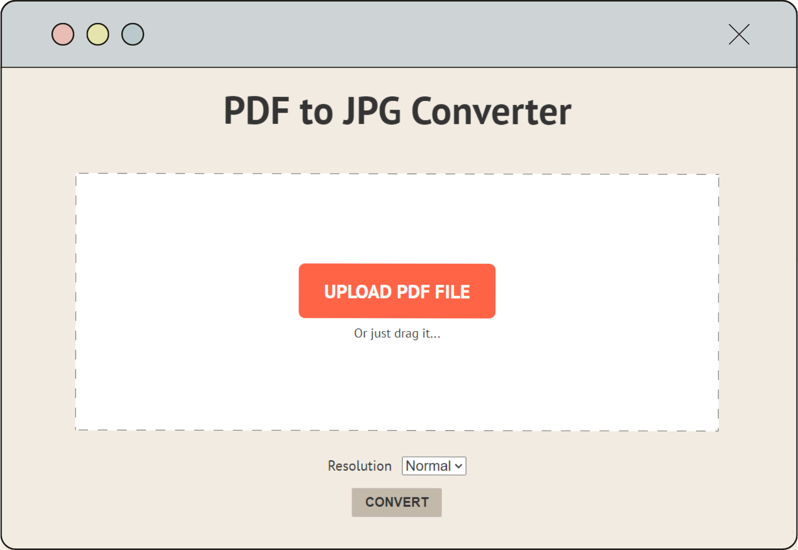

# PDF to JPG Converter

PDF to JPG Converter is a web application built with Flask Python Back-End, HTML, CSS, and JavaScript. It allows users to convert PDF files to JPG images with a choice of three different quality options based on dpi. The application also features a dark mode and utilizes a Flask API for communication between JavaScript and the Python Back-End.



## Features

- Convert PDF files to JPG images with three quality options.
- Dark mode for better user experience.
- Utilizes Flask API for seamless communication between JavaScript and Python Back-End.
- Prove of errors that may collapse the backend server.

## Getting Started

These instructions will help you set up and run the PDF to JPG Converter on your local machine.

### Prerequisites

- Python 3.6 or higher
- Flask framework
- A modern web browser

### Installation

1. Clone the repository:

   ```bash
   git clone https://github.com/marcpozas/PDF-to-JPG-Converter-Flask.git

2. Navigate to the project directory:

   ```bash
   cd PDF-to-JPG-Converter-Flask

3. Install the required dependencies:

   ```bash
   pip install -r requirements.txt

## Usage
1. Start the Flask development server:
   ```bash
   flask run
2. Open your web browser adn access the url where the server is running, for example:
   ```bash
   http://localhost:5000
3. Upload your PDF file and choose the desired quality option for the JPG conversion.
4. Click the "Convert" button to initiate the conversion process.
5. Once the conversion is complete, you can download the converted JPG images.

## Contributing
Contributions are welcome! If you find any bugs or want to enhance the functionality of the PDF to JPG Converter, feel free to open an issue or submit a pull request.

## License
This project is licensed under the MIT License.

## Acknowledgements
- [Flask](https://flask.palletsprojects.com/) - Python web framework
- [PDF2Image](https://pypi.org/project/pdf2image/) - Python library for PDF to image conversion
